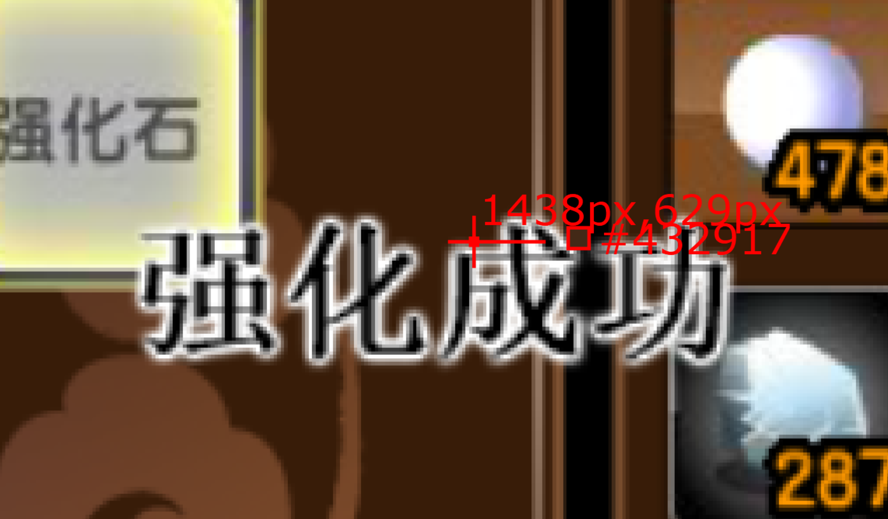
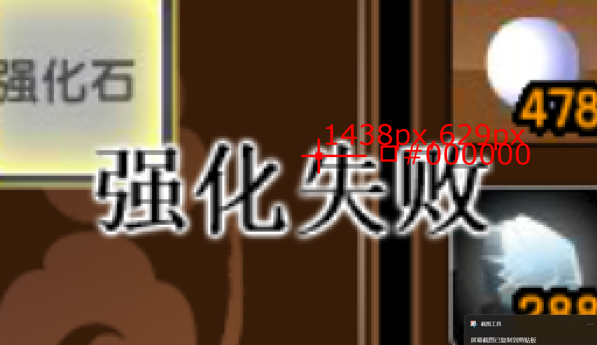
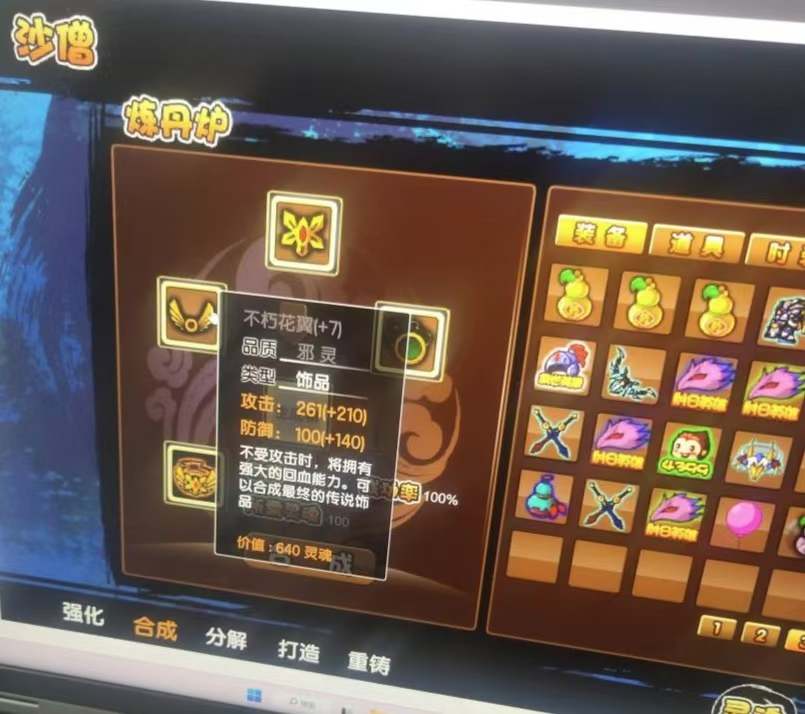

# 造梦西游3 自动打造/强化

## 依赖库：

- pyautogui

- pytesseract

- PIL

（requirements.txt）

## 自动打造：

**utils.py -> build()**

## 自动强化：

**utils.py ->strengthen()**

## 自动购买玄铁

**utils.py ->buyIron()**

### 自动合成指定五行法宝：

**utils.py ->merge()**

*注：变量全在函数里面*

## Two tricks:

### 1.对图像预处理后，使用pytesseract库

使用简单的pytesseract OCR提取文本速度快，缺点是识别精度低，因此图像预处理：


裁剪出文本所在位置的图像

-->

根据字体颜色提取字体所在像素，其余像素置为全黑

-->

输入进pytesseract提取出字符串-->转为int


即：


**-->**


**-->**

**237 = int("237")**

```python
def getText(box, font_color=None):
    image = screenshot()
    # image = PIL.Image.open(r"C:\Users\xxx\Pictures\Screenshots\1.png")
    image = image.crop(box)
    # image.show()
    image = image.convert('RGB')
    tolerance = 20
    image = np.array(image)
    # print(image.shape)
    if font_color != None:
        image = 255*np.ones_like(image) * (np.mean(abs(image - font_color), axis=2, keepdims=True) < tolerance)

    new_image = PIL.Image.fromarray(image)
    new_image.convert('L')
    # new_image.show()
    config = '--psm 6 --oem 1'

    return pytesseract.image_to_string(new_image, config=config)
```

### 2.对于强化任务，只检测一个像素

强化任务只有“强化成功”“强化失败”两种情况，可只检测两种情况中某个像素不同的点，加快速度：

```python
def getPixel(point):
    sleep(0.05)
    img = screenshot()
    return img.getpixel(point)
```

```python
def isSameColor(c1, c2, tolerance=20):
    sum = 0
    for i in range(3):
        sum += abs(c1[i] - c2[i])
    return sum <= 3 * tolerance
```



#### vs



## 完成：




代码：

https://github.com/PUBGprofessor/GameTools.git

## 参考文献：

【1】https://blog.csdn.net/dcrmg/article/details/102963336?fromshare=blogdetail&sharetype=blogdetail&sharerId=102963336&sharerefer=PC&sharesource=m0_74167177&sharefrom=from_link

【2】https://blog.csdn.net/qq_41567921/article/details/134813496?fromshare=blogdetail&sharetype=blogdetail&sharerId=134813496&sharerefer=PC&sharesource=m0_74167177&sharefrom=from_link

【3】Python OCR工具pytesseract详解 - 头还没秃的文章 - 知乎https://zhuanlan.zhihu.com/p/448253254